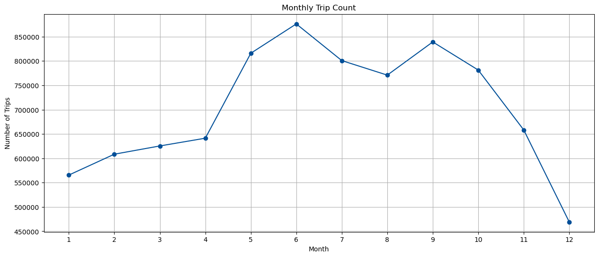

# Usage Patterns and Demand Forecasting for London's Electric Shared Bikes
**Code:** [`Jupyter notebook`]()  
**Presentation:** [`Full Report`](https://github.com/hongyue17/electric_bike_demand_forecast_london/blob/main/full_report.pdf) 

Micromobility has proven to be a helpful last-mile solution, and shared bikes are a popular option. While classic shared bikes are common in central London, electric shared bikes have not been introduced at every station. This project aims to examine the potential expansion of the electric bike service area and identify the strategies that should be implemented.

 

## 💿 Data used
Santander introduced e-bikes in September 2022. This study used 2023 trip data from Santander Cycles, with a total of 8,563,356 journeys. In 2023, there were 800 docking stations and 12,000 bikes, including 600 electric bikes. The data was provided as open data by Transport for London (TFL).  
*Santander Cycles (formerly Barclays Cycle Hire) is a public bicycle hire scheme in London in the United Kingdom.*

 

## 💡 Key findings:
- Both classic and e-bikes experience the highest usage during the morning peak (8-9 AM) and evening peak (5-7 PM). Weekday usage is consistently higher than on weekends.
- The decrease in e-bike usage during the winter is less significant compared to classic bikes.
- **Usage Patterns**
  - **Classic Bikes**: Primarily used for recreational purposes, especially on routes near parks. It’s common for users to rent and return the bikes at the same station, indicating a more leisure-oriented use.
  - **E-Bikes**: Primarily used for commuting. Popular stations are located at key transit hubs, showing that commuters prefer e-bikes for their time-saving benefits.

 
 

## 📈 Overall 
### What is the overall trend?
Summer sees higher bike usage compared to winter, and the number of electric bike trips follows this overall seasonal variation.  

 

 

### How many people choose e-bikes to move around London?
Approximately **7% of shared bike users** opt for e-bikes. This percentage fluctuates between 6.5% and 8.5% throughout the year, with a higher percentage of e-bike use in the winter.  

 

 

### How long do people use shared bikes?
Both bike types are used for **longer durations in the summer** than in the winter. Classic bikes are typically used for longer periods than e-bikes, but during winter—especially in November and December—e-bikes are used for longer durations.  

 

 

## ⏰ When: Temporal Distribution
### When is the peak time?
The peak times are in the morning (8-9 AM) and evening (5-7 PM), with weekday usage being higher than on weekends.  

 

 
 

## 📍 Where: Geospatial Distribution

### Which stations are popular?
**High-traffic transit hubs**, such as Waterloo Station and Liverpool Street, see significant usage for both bike types. Classic bikes are also popular at stations near parks, such as those surrounding Hyde Park, indicating more recreational use. In contrast, **e-bikes are commonly used at stations in northern areas** like Islington and Hackney, reflecting more **commuter-focused** usage.  

 

**Top 10 Bike Stations Comparison**
|   Rank | Classic Bike Station                |   Classic Counts | E-Bike Station                      |   E-Bike Counts |
|-------:|:------------------------------------|-----------------:|:------------------------------------|----------------:|
|      1 | Hyde Park Corner, Hyde Park         |           108954 | St. James’s Square, St. James’s     |            7098 |
|      2 | Waterloo Station 3, Waterloo        |            92052 | Waterloo Station 3, Waterloo        |            6937 |
|      3 | Wormwood Street, Liverpool Street   |            70025 | Wormwood Street, Liverpool Street   |            6551 |
|      4 | Waterloo Station 1, Waterloo        |            69451 | Little Argyll Street, West End      |            6393 |
|      5 | Hop Exchange, The Borough           |            65916 | Islington Green, Angel              |            5955 |
|      6 | Brushfield Street, Liverpool Street |            65775 | Soho Square, Soho                   |            5220 |
|      7 | Black Lion Gate, Kensington Gardens |            65573 | London Fields, Hackney Central      |            4890 |
|      8 | Duke Street Hill, London Bridge     |            62888 | Brushfield Street, Liverpool Street |            4890 |
|      9 | Albert Gate, Hyde Park              |            62178 | Liverpool Road (N1 Centre), Angel   |            4701 |
|     10 | St. James’s Square, St. James’s     |            58293 | Waterloo Station 1, Waterloo        |            4686 |

 

 

### What routes are popular?
The most popular routes for classic bikes tend to have the same start and end points, suggesting that users are likely using them for relaxation or exercise rather than travel. For e-bikes, routes like **Stratford Station to Monier Road, Hackney** Wick are popular for both directions, and **e-bike routes often connect with major transit stations** like Stratford, Paddington, Waterloo, and Liverpool Street.  

 

**Top 5 Popular Classic Bike Routes**

| Rank | Start Station                          | End Station                            | Counts |
|------|----------------------------------------|----------------------------------------|--------|
| 1    | Hyde Park Corner, Hyde Park            | Hyde Park Corner, Hyde Park            | 17,906 |
| 2    | Podium, Queen Elizabeth Olympic Park   | Podium, Queen Elizabeth Olympic Park   | 9,051  |
| 3    | Albert Gate, Hyde Park                 | Albert Gate, Hyde Park                 | 7,309  |
| 4    | Black Lion Gate, Kensington Gardens    | Black Lion Gate, Kensington Gardens    | 6,972  |
| 5    | Triangle Car Park, Hyde Park           | Triangle Car Park, Hyde Park           | 6,157  |

 

**Classic Bike Route Distribution** (Top 1500 routes displayed)  
Explore the classic bike interactive map [here](https://hongyue17.github.io/electric_bike_usage_pattern_london/classic_map.html).
 

 

**Top 5 Popular E-bike Routes**

| Rank | Start Station                          | End Station                            | Counts |
|------|----------------------------------------|----------------------------------------|--------|
| 1    | Stratford Station, Stratford           | Monier Road, Hackney Wick              | 291    |
| 2    | London Street, Paddington              | Little Argyll Street, West End         | 260    |
| 3    | Monier Road, Hackney Wick              | Stratford Station, Stratford           | 222    |
| 4    | Wormwood Street, Liverpool Street      | Waterloo Station 3, Waterloo           | 193    |
| 5    | Podium, Queen Elizabeth Olympic Park   | Podium, Queen Elizabeth Olympic Park   | 176    |

 

**Ebike Route Distribution** (displayed top 1500 routes)  
Explore the electric bike interactive map [here](https://hongyue17.github.io/electric_bike_usage_pattern_london/ebike_map.html).

 

 
The interactive map shows the most popular routes. A line represents a journey with a distinct start and end point, while a circle indicates that the bike was rented and returned at the same location. The wider the line and the larger the circle, the more popular the route. When hovering over a line, details such as the number of trips and the percentage of all electric bike journeys are displayed.  
 

## 🔍 Tool for Assisting Expansion
To assist with expansion, a random forest machine learning model is developed for demand prediction. By entering the station name, day of the week, and time, the model can estimate the demand for e-bikes.

For example, you could ask, "How many bikes are needed at Elephant & Castle station on Thursday at 19:00?"
The model will respond, "Predicted demand for LSBU (Borough Road), Elephant & Castle on Thursday at 19:00 is: 6.45 bikes."

 

 

## Recommendations for Expanding the E-Bike Service
1. **Focus on High-Demand Areas**
   The data shows that e-bikes are heavily used in northern areas like Islington and Hackney, which are popular for commuting. Expanding the number of e-bike docking stations in these regions and other key commuting corridors could help meet the demand
2. **Focus on Transit Hubs**
   Major transit hubs such as Waterloo, Liverpool Street, and Stratford already see high usage of e-bikes. Adding more e-bikes at these locations, as well as other major transport hubs, would facilitate smoother multi-modal journeys, allowing users to easily transition from public transport to e-bikes.
3. **Increase E-Bike Supply During Peak Times**
   The usage patterns show clear peaks in the morning and evening. Allocating more e-bikes during these times or introducing dynamic redistribution strategies could help address shortages and balance bike availability across stations.
4. **Promote E-Bikes in Winter**
   Since e-bikes are less affected by weather conditions, a targeted winter promotion could increase ridership during colder months. Offering discounts or incentives to use e-bikes during this period could make them more attractive for commuting.

 

**Skills:** Data Cleaning and Processing, Statistical Analysis, Demand Forecasting, Geospatial Analysis, Web Scraping, Visualisation.  
**Technology:** **Python**: Pandas, Numpy, Scikit-learn, Statsmodels, Scipy, Sklearn(Random Forest), Geopandas, Selenium, Seaborn, Matplotlib, Folium, Calplot. **R**: dplyr, tidyr, ggplot2, tmap.
